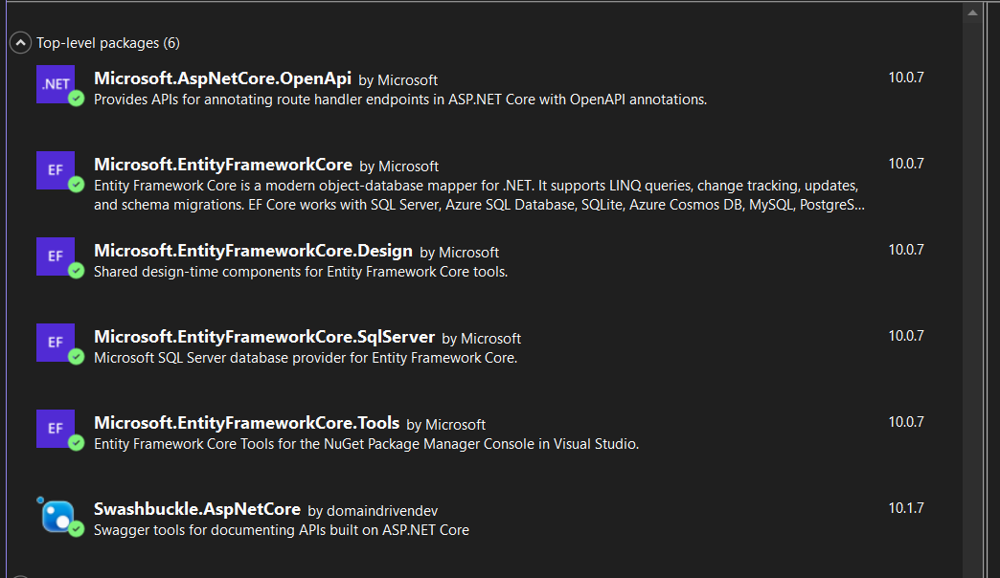
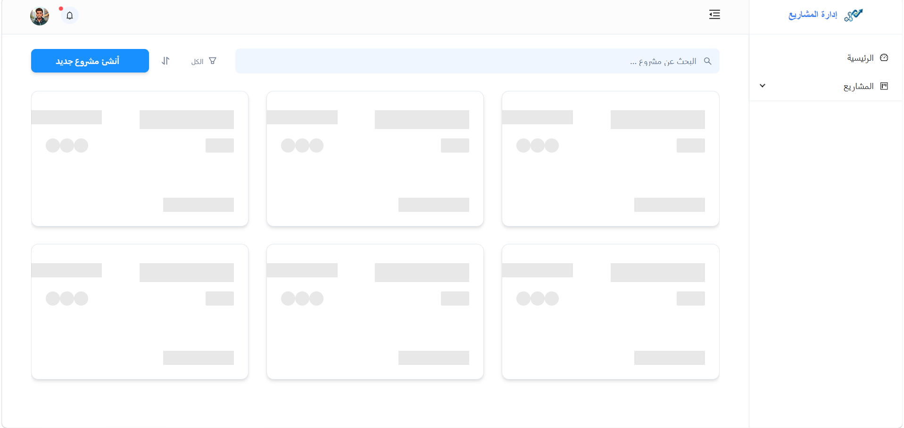
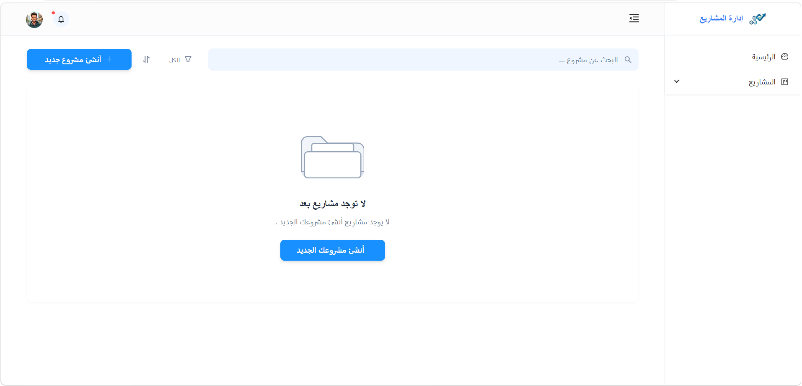
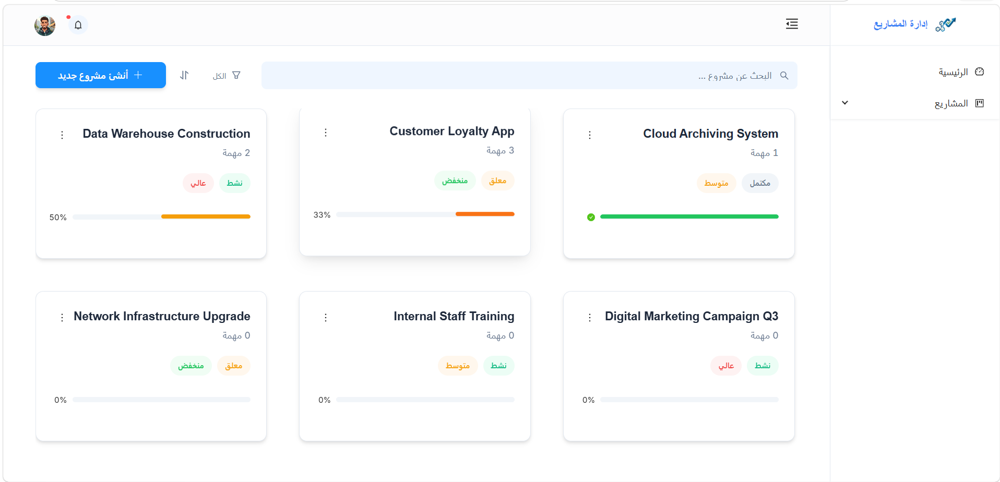
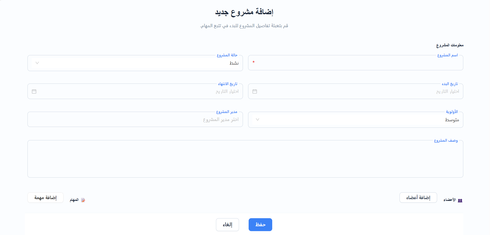
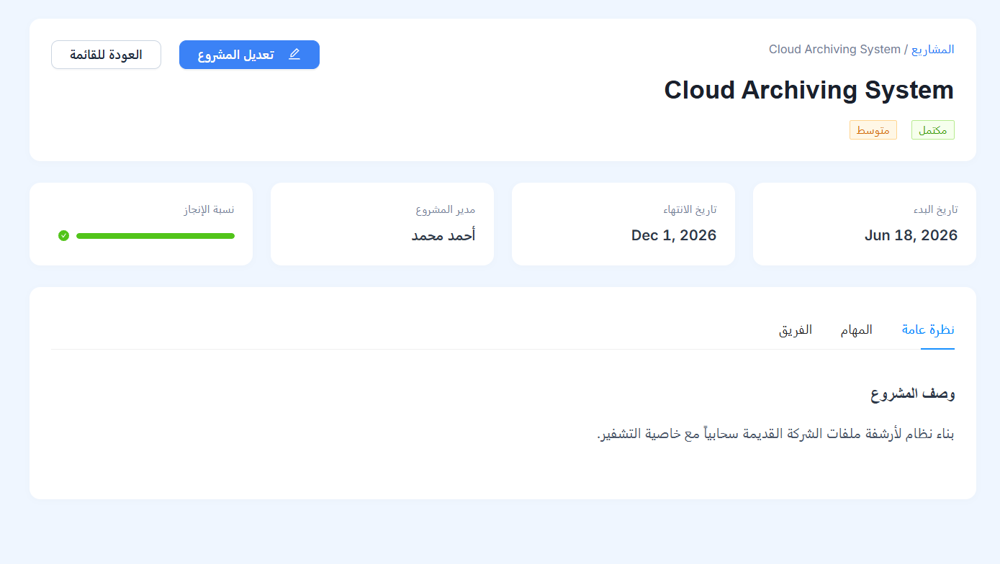
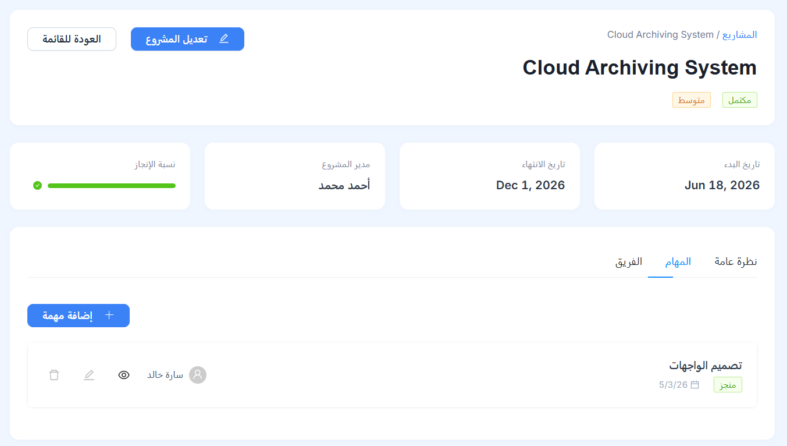
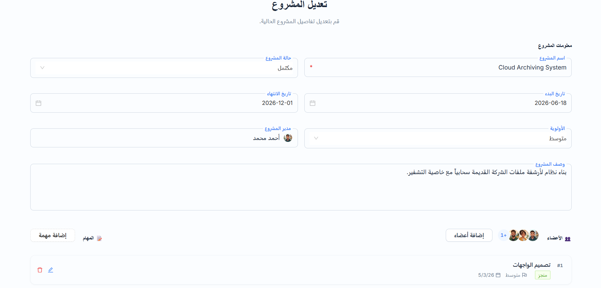
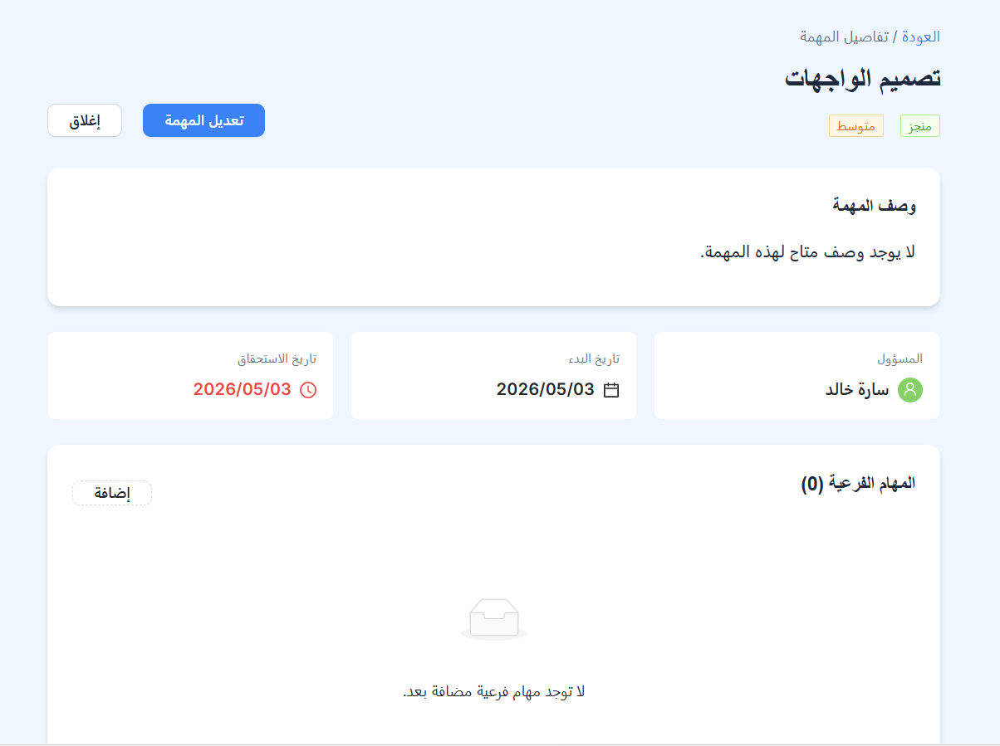
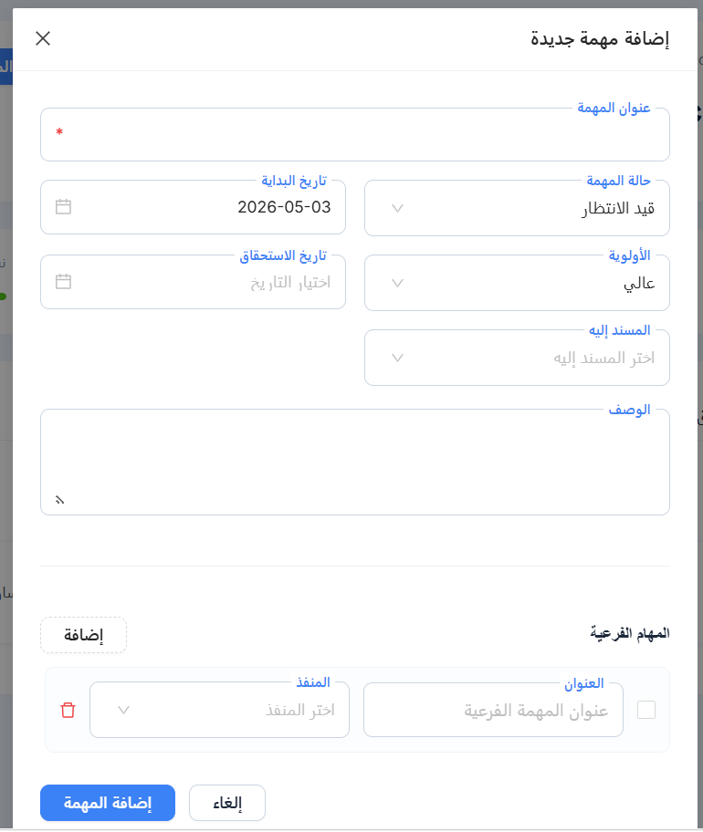

# نظام إدارة المشاريع والمهام الشامل (Full-Stack Project & Task Management System)

تطبيق متكامل لإدارة المشاريع والمهام، يجمع بين قوة **ASP.NET Core** في الواجهة البرمجية ومرونة **Angular 21** في واجهة المستخدم.

---

## 🚀 دليل التنزيل والتشغيل (Quick Start Guide)

اتبع هذه الخطوات بدقة لتشغيل المشروع بالكامل على جهازك المحلي.

### 1️⃣ نسخ المستودع (Clone the Repository)

قم بفتح الطرفية (Terminal) وكتابة الأمر التالي:

```bash
git clone https://github.com/EyadAlshamiri/project-and--task-management-system.git
cd project-and--task-management-system
```

---

### 2️⃣ تشغيل الواجهة البرمجية (Backend Setup - ASP.NET Core)

1. **انتقل إلى مجلد الباك أند:**

   ```bash
   cd ProjectTaskManagement.API
   ```

     📁 قائمة الحزم الأساسية المثبتة (Key Packages)
   بناءً على ملفات المشروع:

- **Microsoft.EntityFrameworkCore.SqlServer (10.0.7)**: للاتصال بقاعدة البيانات.
- **Microsoft.EntityFrameworkCore.Tools (10.0.7)**: لإدارة التهجير (Migrations).
- **Swashbuckle.AspNetCore (10.1.7)**: لتوليد وثائق Swagger API.
- **Microsoft.AspNetCore.OpenApi (10.0.7)**: لدعم مواصفات OpenAPI.



2. **تعديل قاعدة البيانات:**
   افتح ملف `ProjectTaskManagement.API/appsettings.json` وقم بتعديل `DefaultConnection` لتتوافق مع اسم السيرفر لديك في SQL Server.

3. **إعداد قاعدة البيانات (Database Setup)**
   تبع الخطوات التالية لتنفيذ الـ Migrations وتحديث قاعدة البيانات:

   من الشريط العلوي في Visual Studio:
   اختر Tools
   ثم اختر NuGet Package Manager
   بعد ذلك اضغط على Package Manager Console
   من داخل نافذة Package Manager Console:

   تأكد من اختيار المشروع التالي كـ Default Project:

   ProjectTaskManagement.Infrastructure

   تنفيذ أمر إنشاء Migration:

   ```bash
   Add-Migration Migration_Name
   ```

   تحديث قاعدة البيانات:

   ```bash
   Update-Database
   ```

4. **تشغيل السيرفر:**
   ```bash
   dotnet run --project ProjectTaskManagement.API
   ```
   _سيعمل السيرفر غالباً على العنوان: `http://localhost:5241`_

---

### 3️⃣ تشغيل واجهة المستخدم (Frontend Setup - Angular)

1. **افتح نافذة طرفية جديدة وانتقل لمجلد الفرونت إند:**

   ```bash
   cd project-task-management-ui
   ```

2. **تثبيت المكتبات:**

   ```bash
   npm install
   ```

3. **تشغيل التطبيق:**
   ```bash
   ng serve
   ```
   _افتح المتصفح على: `http://localhost:4200`_

---

## 📁 هيكل المشروع (Project Structure)

- **`ProjectTaskManagement.API/`**: يحتوي على منطق الباك أند، قاعدة البيانات، والخدمات.
- **`project-task-management-ui/`**: يحتوي على واجهة المستخدم المبنية بـ Angular و NG-ZORRO.

---

## ✨ التقنيات المستخدمة (Tech Stack)

| المجال             | التقنية المستخدمة          |
| :----------------- | :------------------------- |
| **الفرونت إند**    | Angular 21, NG-ZORRO, RxJS |
| **الباك أند**      | ASP.NET Core 10.0, EF Core |
| **قاعدة البيانات** | SQL Server                 |
| **التوثيق**        | Swagger / OpenAPI          |

---


## واجهات المستخدم (User Interfaces)













## 📧 التواصل (Contact)

- **المهندس:** إياد الشميري
- **واتساب:** +967 738 928 202
- **إيميل:** engineeriyadalshamiri@gmail.com

---

> تم إعداد هذا الدليل لتسهيل عملية البدء والتطوير. بالتوفيق!
